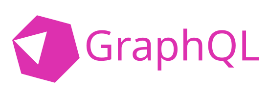

GraphQL server library for Crystal.

- **Boilerplate-free**: Schema generated at compile time
- **Type-safe**: Crystal guarantees your code matches your schema
- **High performance**: See [benchmarks](https://github.com/graphql-crystal/benchmarks)

## Getting Started

Install the shard by adding the following to our `shard.yml`:

```yaml
dependencies:
  graphql:
    github: graphql-crystal/graphql
```

Then run `shards install`.

The first step is to define a query object. This is the root type for all
queries and it looks like this:

```crystal
require "graphql"

@[GraphQL::Object]
class Query < GraphQL::BaseQuery
  @[GraphQL::Field]
  def hello(name : String) : String
    "Hello, #{name}!"
  end
end
```

Now we can create a schema object:

```crystal
schema = GraphQL::Schema.new(Query.new)
```

To verify we did everything correctly, we can print out the schema:

```crystal
puts schema.document.to_s
```

Which, among several built-in types, prints our query type:

```graphql
type Query {
  hello(name: String!): String!
}
```

To serve our API over HTTP we call `schema.execute` with the request parameters and receive a JSON string. Here is an example for Kemal:

```crystal
post "/graphql" do |env|
  env.response.content_type = "application/json"

  query = env.params.json["query"].as(String)
  variables = env.params.json["variables"]?.as(Hash(String, JSON::Any)?)
  operation_name = env.params.json["operationName"]?.as(String?)

  schema.execute(query, variables, operation_name)
end
```

Now we're ready to query our API:

```bash
curl \
  -X POST \
  -H "Content-Type: application/json" \
  --data '{ "query": "{ hello(name: \"John Doe\") }" }' \
  http://0.0.0.0:3000/graphql
```

This should return:

```json
{ "data": { "hello": "Hello, John Doe!" } }
```

For easier development, we recommend using [GraphiQL](https://github.com/graphql/graphiql).
A starter template combining Kemal and GraphiQL is found at [examples/graphiql](examples/graphiql).

## Context

`context` is a optional argument that our fields can retrieve. It lets fields
access global data, like database connections.

```crystal
# Define our own context type
class MyContext < GraphQL::Context
  @pi : Float64
  def initialize(@pi)
  end
end

# Pass it to schema.execute
context = MyContext.new(Math::PI)
schema.execute(query, variables, operation_name, context)

# Access it in our fields
@[GraphQL::Object]
class MyMath < GraphQL::BaseObject
  @[GraphQL::Field]
  def pi(context : MyContext) : Float64
    context.pi
  end
end
```

Context instances must not be reused for multiple executions.

## Concurrency

By default, a query is resolved sequentially in the fiber that called
`schema.execute`. To resolve fields and array elements concurrently, set
`max_concurrency` on the context:

```crystal
context = MyContext.new(Math::PI)
context.max_concurrency = 8
schema.execute(query, variables, operation_name, context)
```

This is the maximum number of fibers a single execution may have running at
once. When the budget is used up, remaining work runs inline, so a large
list never fans out into an unbounded number of fibers. Choose a value your
downstream resources can sustain; resolvers that check out database
connections should stay below the connection pool size.

## Complexity

To reject operations that select too many fields, set `max_complexity` on the
context:

```crystal
context = MyContext.new(Math::PI)
context.max_complexity = 200
schema.execute(query, variables, operation_name, context)
```

Complexity is the number of fields the operation selects, counted across the
whole selection tree with fragments expanded. It is computed before any
resolver runs, and an operation over the limit is answered with an error and
no data. After execution, `context.complexity` holds the count.

Nesting depth is limited separately. Selection sets, lists and input objects
may nest `max_depth` levels, 100 by default, and a deeper query is rejected
while parsing. Real queries rarely pass twenty levels; the limit exists so a
hostile query cannot exhaust the stack:

```crystal
context.max_depth = 30
```

## Objects

Objects are perhaps the most commonly used type in GraphQL. They are implemented
as classes. To define a object, we need a `GraphQL::Object` annotation and to inherit
`GraphQL::BaseObject`. Fields are methods with a `GraphQL::Field` annotation.

```crystal
@[GraphQL::Object]
class Foo < GraphQL::BaseObject
  # type restrictions are mandatory on fields
  @[GraphQL::Field]
  def hello(first_name : String, last_name : String) : String
    "Hello #{first_name} #{last_name}"
  end

  # besides basic types, we can also return other objects
  @[GraphQL::Field]
  def bar : Bar
    Bar.new
  end
end

@[GraphQL::Object]
class Bar < GraphQL::BaseObject
  @[GraphQL::Field]
  def baz : Float64
    42_f64
  end
end
```

For simple objects, we can use instance variables:

```crystal
@[GraphQL::Object]
class Foo < GraphQL::BaseObject
  @[GraphQL::Field]
  property bar : String

  @[GraphQL::Field]
  getter baz : Float64

  def initialize(@bar, @baz)
  end
end
```

## Query

Query is the root type of all queries.

```crystal
@[GraphQL::Object]
class Query < GraphQL::BaseQuery
  @[GraphQL::Field]
  def echo(str : String) : String
    str
  end
end

schema = GraphQL::Schema.new(Query.new)
```

## Mutation

Mutation is the root type for all mutations.

```crystal
@[GraphQL::Object]
class Mutation < GraphQL::BaseMutation
  @[GraphQL::Field]
  def echo(str : String) : String
    str
  end
end

schema = GraphQL::Schema.new(Query.new, Mutation.new)
```

## Input Objects

Input objects are objects that are used as field arguments. To define an input
object, use a `GraphQL::InputObject` annotation and inherit `GraphQL::BaseInputObject`.
It must define a constructor with a `GraphQL::Field` annotation.

```crystal
@[GraphQL::InputObject]
class User < GraphQL::BaseInputObject
  getter first_name : String?
  getter last_name : String?

  @[GraphQL::Field]
  def initialize(@first_name : String?, @last_name : String?)
  end
end
```

## Enums

Defining enums is straightforward. Just add a `GraphQL::Enum` annotation:

```crystal
@[GraphQL::Enum]
enum IPAddressType
  IPv4
  IPv6
end
```

## Scalars

The following scalar values are supported:

- `Int32` <-> `Int`
- `Float64` <-> `Float`
- `String` <-> `String`
- `Bool` <-> `Boolean`
- `GraphQL::Scalars::ID` <-> `String`

Built-in custom scalars:

- `GraphQL::Scalars::BigInt` <-> `String`

Custom scalars are created by implementing from_json/to_json:

```crystal
@[GraphQL::Scalar]
class ReverseStringScalar < GraphQL::BaseScalar
  @value : String

  def initialize(@value)
  end

  def self.from_json(string_or_io)
    self.new(String.from_json(string_or_io).reverse)
  end

  def to_json(builder : JSON::Builder)
    builder.scalar(@value.reverse)
  end
end
```

## Interfaces

An interface is an abstract class or a module with a `GraphQL::Interface`
annotation. Its fields are `GraphQL::Field` methods, abstract or not. Objects
that inherit from the class or include the module implement the interface,
and fields may return the interface type:

```crystal
@[GraphQL::Interface]
abstract class Character < GraphQL::BaseObject
  @[GraphQL::Field]
  abstract def name : String
end

@[GraphQL::Object]
class Human < Character
  @[GraphQL::Field]
  def name : String
    "Luke"
  end

  @[GraphQL::Field]
  def home_planet : String
    "Tatooine"
  end
end

@[GraphQL::Object]
class Query < GraphQL::BaseQuery
  @[GraphQL::Field]
  def hero : Character
    Human.new
  end
end
```

Every object implementing an interface is part of the schema as soon as the
interface is. Fields specific to one implementation are selected through
fragments with a type condition, and `__typename` reports the concrete type:

```graphql
{
  hero {
    __typename
    name
    ... on Human {
      homePlanet
    }
  }
}
```

## Unions

A union is a module with a `GraphQL::Union` annotation. Objects that include
the module are its member types. A union has no fields of its own, so
selections on it must go through type conditions:

```crystal
@[GraphQL::Union]
module SearchResult
end

@[GraphQL::Object]
class Human < GraphQL::BaseObject
  include SearchResult
  # ...
end

@[GraphQL::Object]
class Starship < GraphQL::BaseObject
  include SearchResult
  # ...
end

@[GraphQL::Object]
class Query < GraphQL::BaseQuery
  @[GraphQL::Field]
  def search(text : String) : Array(SearchResult)
    [Human.new, Starship.new] of SearchResult
  end
end
```

```graphql
{
  search(text: "a") {
    __typename
    ... on Human { name }
    ... on Starship { length }
  }
}
```

Both annotations accept `name` and `description` like `GraphQL::Object`.

## Subscriptions

A subscription type inherits `GraphQL::BaseSubscription`. Its fields return a
`Channel` whose element type is the field's GraphQL type, and every value sent
on the channel becomes one response. `GraphQL::Broadcast` fans values out to
any number of subscribers, which is the usual way to publish from a mutation:

```crystal
MESSAGES = GraphQL::Broadcast(Message).new

@[GraphQL::Object]
class Mutation < GraphQL::BaseMutation
  @[GraphQL::Field]
  def post(text : String) : Message
    message = Message.new(text)
    MESSAGES.publish(message)
    message
  end
end

@[GraphQL::Object]
class Subscription < GraphQL::BaseSubscription
  @[GraphQL::Field]
  def message_added : Channel(Message)
    MESSAGES.subscribe
  end
end

schema = GraphQL::Schema.new(Query.new, Mutation.new, Subscription.new)
```

`schema.subscribe` takes the same arguments as `schema.execute` and returns a
`GraphQL::Subscription` that yields response documents. It ends when the
resolver's channel closes. Call `close` to unsubscribe, which also closes the
resolver's channel:

```crystal
subscription = schema.subscribe(%(subscription { messageAdded { text } }))
spawn do
  subscription.each do |response|
    puts response # {"data":{"messageAdded":{"text":"hi"}}}
  end
end
```

A request that cannot be started, for example because it selects two root
fields, yields a single error response and is already closed.

### Over WebSockets

`GraphQL::Transport::WebSocket` speaks the `graphql-transport-ws` protocol
used by graphql-ws, Apollo Client, urql and Relay. It is not loaded by
`require "graphql"`. With Kemal:

```crystal
require "graphql/transport/ws"

ws "/graphql" do |socket, env|
  GraphQL::Transport::WebSocket.new(schema, socket) { MyContext.new(env) }
end
```

With the standard library's `HTTP::Server`, pass the protocol name so the
handshake negotiates it, which browsers require:

```crystal
HTTP::WebSocketHandler.new([GraphQL::Transport::WebSocket::PROTOCOL]) do |socket, http|
  GraphQL::Transport::WebSocket.new(schema, socket) { MyContext.new(http.request) }
end
```

The block builds the context for every operation on the connection. Queries
and mutations sent over the socket are executed once.

## Annotation Arguments

### name

Supported on: `Object`, `InputObject`, `Field`, `Enum`, `Scalar`

We can use the `name` argument to customize the introspection type name of a
type. This is not needed in most situations because type names are automatically
converted to PascalCase or camelCase. However, `item_id` converts to
`itemId`, but we might want to use `itemID`. For this, we can use the `name`
argument.

```crystal
@[GraphQL::Object(name: "Sheep")]
class Wolf
  @[GraphQL::Field(name: "baa")]
  def howl : String
    "baa"
  end
end
```

### description

Supported on: `Object`, `InputObject`, `Field`, `Enum`, `Scalar`

Describes the type. Descriptions are available through the introspection interface
so it's always a good idea to set this argument.

```crystal
@[GraphQL::Object(description: "I'm a sheep, I promise!")]
class Wolf
end
```

### deprecated

Supported on: `Field`

The deprecated argument marks a type as deprecated.

```crystal
class Sheep
  @[GraphQL::Field(deprecated: "This was a bad idea.")]
  def fight_wolf : String
    "Wolf ate sheep"
  end
end
```

### values

On enums, `values` describes or deprecates members by constant name:

```crystal
@[GraphQL::Enum(values: {
  Red:  {description: "Like a rose"},
  Blue: {deprecated: "Use Navy"},
})]
enum Color
  Red
  Blue
  Navy
end
```

### specified_by_url

On scalars, `specified_by_url` points at the specification of the scalar's
format and is reported as `specifiedByURL` in introspection:

```crystal
@[GraphQL::Scalar(specified_by_url: "https://tools.ietf.org/html/rfc3339")]
record DateTime, value : Time do
  # ...
end
```

### arguments

Sets names and descriptions for field arguments. Note that
arguments cannot be marked as deprecated.

Each argument may set `name`, `description` and `deprecated`:

```crystal
class Sheep
  @[GraphQL::Field(arguments: {weapon: {name: "weaponName", description: "The weapon the sheep should use."}})]
  def fight_wolf(weapon : String) : String
    if weapon == "Atomic Bomb"
      "Sheep killed wolf"
    else
      "Wolf ate sheep"
    end
  end
end
```

## Field Arguments

Field arguments are automatically resolved. A type with a default value becomes
optional. A nilable type is also considered a optional type.
